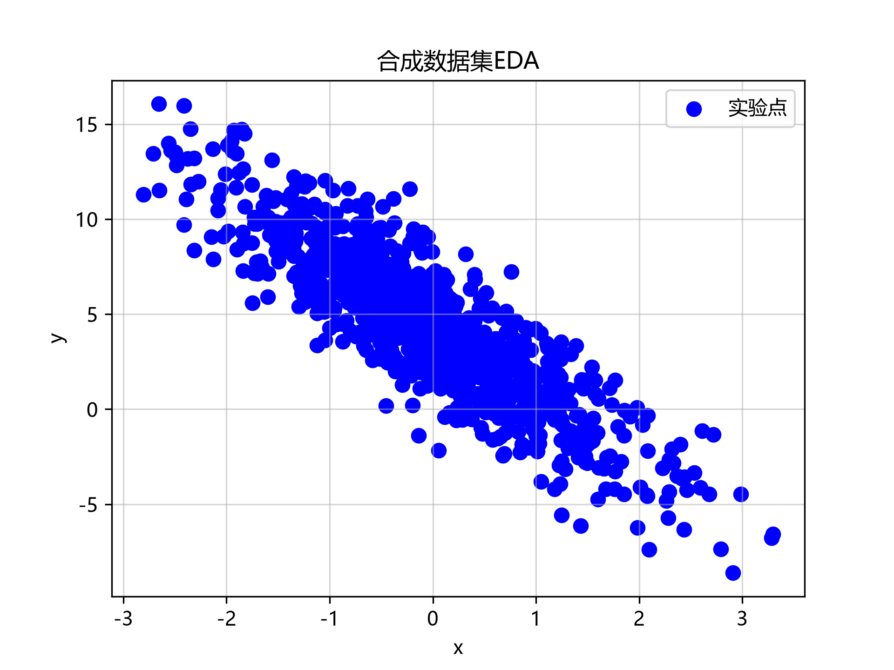
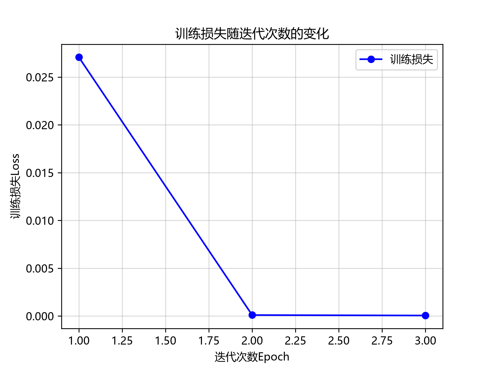

# 线性网络学习心得

---

## 一、学习目标与疑问

本阶段主要学习线性回归及其在深度学习框架中的实现。
最初对线性回归的理解主要停留在：
**输入数据 → 模型 → 损失函数 → 优化器**
但这种理解更接近 API 层面的使用，并没有真正理解参数为什么能够通过梯度下降得到更新。
因此，本阶段希望重点弄清楚以下问题：

- 线性回归模型的数学形式是什么？
- 为什么使用平方损失？
- 如何从损失函数推导参数梯度？
- 梯度下降究竟如何更新参数？
- backward() 与优化器 step() 在数学上分别对应什么过程？
- 为什么实际训练采用小批量随机梯度下降？
- 向量化在训练过程中解决了什么问题？

## 二、核心知识

**核心函数**

```Python
def linreg(X, w, b):
    """线性回归模型"""
    return torch.matmul(X, w) + b

def squared_loss(y_hat, y): 
    """均方损失"""
    return (y_hat - y.reshape(y_hat.shape)) ** 2 / 2

def sgd(params, lr, batch_size):
    """小批量随机梯度下降"""
    with torch.no_grad():
        for param in params:
            param -= lr * param.grad / batch_size
            param.grad.zero_()
def train():
    lr = 0.03
    num_epochs = 3
    #函数指针指向模型和损失函数
    net = linreg
    loss = squared_loss
    epoch_losses = []  # 记录每个epoch的损失
    for epoch in range(num_epochs):
        #分批次（Batch） 
        for X, y in data_iter(batch_size, features, labels):
            #算误差（Forward）
            l = loss(net(X, w, b), y)  # X和y的小批量损失
            # 因为l形状是(batch_size,1)，而不是一个标量。l中的所有元素被加到一起，
            # 并以此计算关于[w,b]的梯度
            #求导（Backward）
            l.sum().backward()
            #沿着梯度反方向挪一步（SGD）
            sgd([w, b], lr, batch_size)  # 使用参数的梯度更新参数
        #清空旧梯度
        with torch.no_grad():
            train_l = loss(net(features, w, b), labels)
            current_loss = float(train_l.mean())
            epoch_losses.append(current_loss) 
            print(f'epoch {epoch + 1}, loss {float(train_l.mean()):f}')
    #绘制loss曲线
    plot_loss(epoch_losses)
```

## 三、数学原理

**线性回归模型**

给定 $d$ 维输入 $\mathbf{x} = [x_1, x_2, \ldots, x_d]^\top$，线性回归的预测为

$$
\hat{y} = w_1 x_1 + w_2 x_2 + \cdots + w_d x_d + b
$$

写成向量形式即

$$
\hat{y} = \mathbf{w}^\top \mathbf{x} + b, \qquad \mathbf{w} \in \mathbb{R}^d,\ b \in \mathbb{R}
$$

对整个数据集（$n$ 个样本）记设计矩阵 $\mathbf{X} \in \mathbb{R}^{n \times d}$，则

$$
\hat{\mathbf{y}} = \mathbf{X}\mathbf{w} + b
$$

代码 `torch.matmul(X, w) + b` 对应的就是这一式（$b$ 通过广播加到每一行）。模型要学的只有 $\mathbf{w}$ 和 $b$：$\mathbf{w}$ 衡量每个特征的影响力，$b$ 是整体偏置。

**均方损失函数**

单个样本的损失定义为

$$
l^{(i)}(\mathbf{w}, b) = \frac{1}{2}\left(\hat{y}^{(i)} - y^{(i)}\right)^2
$$

整个数据集上的损失取平均：

$$
L(\mathbf{w}, b) = \frac{1}{n}\sum_{i=1}^{n} l^{(i)}(\mathbf{w}, b) = \frac{1}{n}\sum_{i=1}^{n} \frac{1}{2}\left(\mathbf{w}^\top \mathbf{x}^{(i)} + b - y^{(i)}\right)^2
$$

学习的目标即

$$
\mathbf{w}^*, b^* = \operatorname*{argmin}_{\mathbf{w}, b} L(\mathbf{w}, b)
$$

系数 $\frac{1}{2}$ 是为了与平方求导时的 $2$ 相消，让梯度形式更简洁。

**小批量随机梯度下降**

每次迭代随机抽取一个小批量 $\mathcal{B}$（$|\mathcal{B}|$ 为批量大小，$\eta$ 为学习率），沿负梯度方向更新：

$$
(\mathbf{w}, b) \leftarrow (\mathbf{w}, b) - \frac{\eta}{|\mathcal{B}|} \sum_{i \in \mathcal{B}} \partial_{(\mathbf{w}, b)} l^{(i)}(\mathbf{w}, b)
$$

对上面的 $l^{(i)}$ 用链式法则逐项求偏导，可得

$$
\partial_{\mathbf{w}} l^{(i)} = \left(\hat{y}^{(i)} - y^{(i)}\right)\mathbf{x}^{(i)}, \qquad \partial_{b} l^{(i)} = \hat{y}^{(i)} - y^{(i)}
$$

代入后即得可直接编码的形式：

$$
\mathbf{w} \leftarrow \mathbf{w} - \frac{\eta}{|\mathcal{B}|}\sum_{i \in \mathcal{B}}\left(\hat{y}^{(i)} - y^{(i)}\right)\mathbf{x}^{(i)}, \qquad b \leftarrow b - \frac{\eta}{|\mathcal{B}|}\sum_{i \in \mathcal{B}}\left(\hat{y}^{(i)} - y^{(i)}\right)
$$

**训练过程**

1. 初始化 $\mathbf{w} \sim \mathcal{N}(0, 0.01^2)$、$b = 0$，并令二者的 `requires_grad=True`；
2. 每个 epoch：先打乱样本顺序，再按 $|\mathcal{B}| = 10$ 切成若干小批量；
3. **前向**：$\hat{\mathbf{y}} = \mathbf{X}\mathbf{w} + b$，经 `squared_loss` 得到每个样本的 $l^{(i)}$；
4. **反向**：`l.sum().backward()` 求出 $\sum_{i \in \mathcal{B}} \partial_{(\mathbf{w}, b)} l^{(i)}$，累加到 `param.grad`；
5. **更新**：`sgd()` 中 `param -= lr * param.grad / batch_size`，其中除以 `batch_size` 正是上式中的 $\frac{1}{|\mathcal{B}|}$；
6. **清零**：`param.grad.zero_()`——PyTorch 的梯度默认累加，不清零则下一轮会把旧梯度一并算进去。

补充一点：线性回归虽然存在解析解 $\mathbf{w}^* = (\mathbf{X}^\top\mathbf{X})^{-1}\mathbf{X}^\top\mathbf{y}$，但它要求矩阵可逆、数据一变就得重算；梯度下降用迭代逼近，且能自然推广到没有解析解的深层模型，因此是更通用的做法。

## 四、自我理解与消化

1. **模型形式**：$\hat{y} = \mathbf{w}^\top\mathbf{x} + b$，本质是仿射变换，学的是"每个特征给多大权重、整体抬高多少"。
2. **为什么用平方损失**：平方使正负误差不相互抵消、对大偏差惩罚更重且处处可导；$\frac{1}{2}$ 让求导结果最简洁。若噪声服从高斯分布，最小化平方损失等价于极大似然估计。
3. **梯度怎么来**：对 $\frac{1}{2}(\hat{y}^{(i)} - y^{(i)})^2$ 用链式法则，$\frac{1}{2}$ 与平方的导数 $2$ 相消，结果就是"残差 × 输入"。
4. **参数如何更新**：梯度指向函数上升最快的方向，因此沿其反方向走一小步，步长由学习率 $\eta$ 控制。
5. **backward() 与 step()**：`backward()` 只负责**算**梯度（自动微分按链式法则反向累积），`step()` 才负责**改**参数。从零实现里没有优化器，`sgd()` 就是手写的 `step()`——"求导"与"更新"是分离的两件事。
6. **为什么用小批量**：全批量每步都要扫全部数据，代价高；单样本梯度方差大、又无法并行。小批量在**计算效率**与**梯度估计方差**之间折中，还能吃满向量化与 GPU 的并行度。
7. **向量化解决了什么**：把逐样本的 Python 循环交给底层 BLAS 批量并行(本质是cpp)，消除了解释器逐次调度的开销——这正是 `torch.matmul` 远快于手写双层`for`循环的原因。

## 五、实验与验证

用 `synthetic_data` 构造 $n = 1000$ 的合成数据，真实参数 $\mathbf{w} = [2, -3.4]^\top$、$b = 4.2$，噪声 $\epsilon \sim \mathcal{N}(0, 0.01^2)$；超参数取 $\eta = 0.03$、$|\mathcal{B}| = 10$、3 个 epoch。

- **EDA**（`合成数据集EDA.png`）：以 $x_2$ 为横轴、$y$ 为纵轴作图，散点呈明显负相关（对应 $w_2 = -3.4$），且只是围绕一条直线的一层窄噪声带。
  
- **损失曲线**（`Loss曲线.png`）：3 个 epoch 内损失从约 $2.7 \times 10^{-2}$ 降到 $10^{-4}$ 量级以下，随后基本持平。
  

*注意到：这个损失曲线的形状是梯形，说明epoch比较少，一次训练就够了 *

- **参数恢复**：训练结束后 $\hat{\mathbf{w}} \approx [2.0, -3.4]^\top$、$\hat{b} \approx 4.2$，与真值误差在 $10^{-3}$ 以内。

说明梯度方向、学习率与批量大小的选择都是合理的，模型成功还原出了生成数据所用的真实参数。（脚本未固定随机种子，每次运行的具体数值会有小幅波动。）

## 六、阶段性总结

- 从"会调 API"进到"看懂每一步在算什么"：`matmul` 是模型、`** 2 / 2` 是损失、`backward` 是求导、`param -= lr * grad / bs` 是梯度下降。
- 三个最容易踩的点：① $\frac{1}{2}$ 是为了抵消平方求导时的 $2$；② `backward()` 与参数更新是两件独立的事；③ PyTorch 梯度默认**累加**，每轮更新后必须 `zero_()`。
- 遗留问题：本次是手写 `sgd()`，下一阶段用 `nn.Linear` + `optim.SGD` 改写后，正好能验证第 5 问中"求导 / 更新"的对应关系。
- 有意思的问题1：如何“最优化”的调整超参数？
- 有意思的问题2：关于epoch的次数的判断
