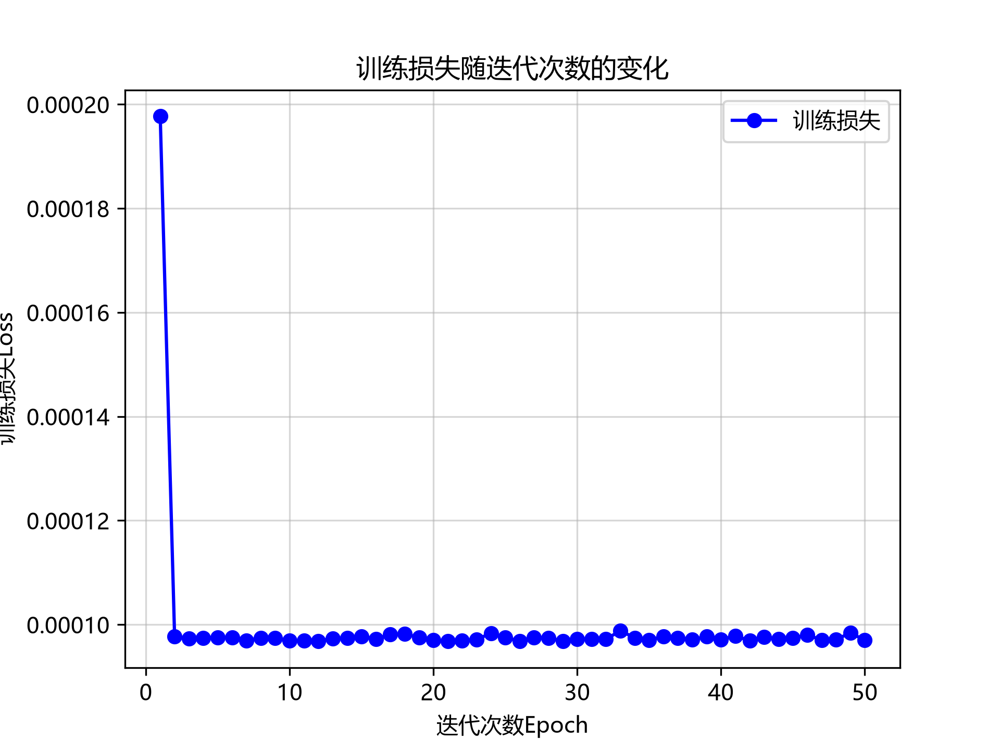

# 一点小疑问

继3.2中的loss曲线，我们期望得到一条更加“美观”的曲线，于是我们将epoch增加到了50。但是结果却没有如期。



观察曲线得出
> 这个loss并不是一直在下降，它是有一定的震荡(特别小)

```PowerShell
  Config.epoch_losses.append(float(l))
epoch 1, loss 0.000198
epoch 2, loss 0.000098
epoch 3, loss 0.000097
epoch 4, loss 0.000097
epoch 5, loss 0.000098
epoch 6, loss 0.000098
epoch 7, loss 0.000097
epoch 8, loss 0.000097
epoch 9, loss 0.000097
epoch 10, loss 0.000097
epoch 11, loss 0.000097
epoch 12, loss 0.000097
epoch 13, loss 0.000097
epoch 14, loss 0.000097
epoch 15, loss 0.000098
epoch 16, loss 0.000097
epoch 17, loss 0.000098
epoch 18, loss 0.000098
epoch 19, loss 0.000097
epoch 20, loss 0.000097
epoch 21, loss 0.000097
epoch 22, loss 0.000097
epoch 23, loss 0.000097
epoch 24, loss 0.000098
epoch 25, loss 0.000098
epoch 26, loss 0.000097
epoch 27, loss 0.000098
epoch 28, loss 0.000097
epoch 29, loss 0.000097
epoch 30, loss 0.000097
epoch 31, loss 0.000097
epoch 32, loss 0.000097
epoch 33, loss 0.000099
epoch 34, loss 0.000097
epoch 35, loss 0.000097
epoch 36, loss 0.000098
epoch 37, loss 0.000097
epoch 38, loss 0.000097
epoch 39, loss 0.000098
epoch 40, loss 0.000097
epoch 41, loss 0.000098
epoch 42, loss 0.000097
epoch 43, loss 0.000098
epoch 44, loss 0.000097
epoch 45, loss 0.000097
epoch 46, loss 0.000098
epoch 47, loss 0.000097
epoch 48, loss 0.000097
epoch 49, loss 0.000098
epoch 50, loss 0.000097
```

**核心问题**
> 为什么会有这样的震荡？


